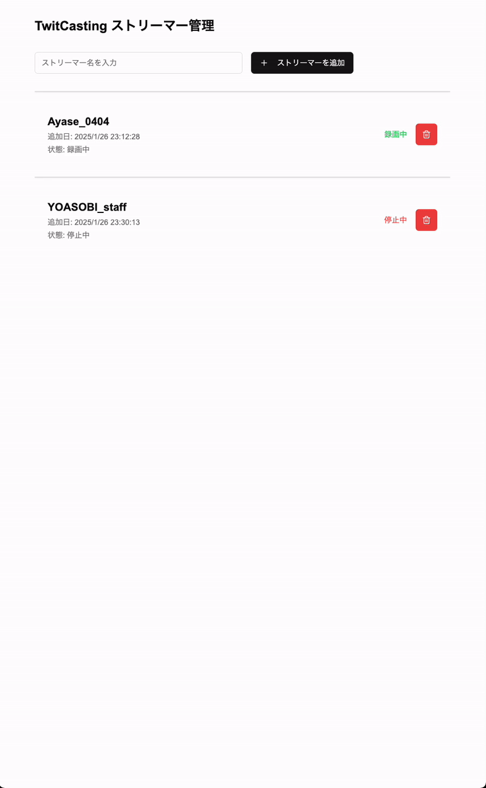

# rec-twitcasting

This application is for recording live streams being broadcasted on twitcasting.tv.

[日本語版はこちら](README_ja.md)

# Important Information

**Please read this carefully.**

## Please Limit to Personal Use Only

Obviously, **you must not repost recordings** without the streamer's permission.

If any misuse is observed, **this repository may be made private**.

## Use at Your Own Risk

Since this application is developed under the MIT License, please use it at your own risk.
The developer assumes no responsibility for any problems that may occur due to the use of this application.

## When Creating Issues

Bug reports are welcome!

However, please follow these guidelines:

- Use the issue template in principle
  - Bug report
  - Feature request
- Make respectful reports
- Check if the issue is already known (including previously closed issues)

These rules must be followed.
Issues may be closed if they do not comply.

# Supporting Environment

- OS: Linux
- Architecture: arm64, x64

# How to Use (Quick Start)

Please install Docker (it might work with podman etc., but this is unverified).
[Official install guide (Japanese)](https://docs.docker.jp/linux/step_one.html)
[Official install script](https://github.com/docker/docker-install)

## Preparation

There are items to be set in environment variables.

- Please obtain a client ID and client secret from the [API Key](#api-key) section. You'll need to specify them as `<YOUR_TWITCASTING_CLIENT_ID>` and `<TWITCASTING_CLIENT_SECRET>`.
- Confirm the IP address or domain name of the server machine where this application will run as `<YOUR_SERVER>`.
  - If you want to run both the frontend (web server application) and backend (API server application) on the same server machine (all-in-one).
  - `<BACKEND_SERVER>` will be the same as `<YOUR_SERVER>` in an all-in-one setup.

## Execution Steps

### 1. Set Environment Variables
```shell
$ cp .env_sample .env
$ sed -i 's/__YOUR_TWITCASTING_CLIENT_ID__/<YOUR_TWITCASTING_CLIENT_ID>/g' .env
$ sed -i 's/__YOUR_TWITCASTING_CLIENT_SECRET__/<TWITCASTING_CLIENT_SECRET>/g' .env
$ sed -i 's/__YOUR_SERVER_IP_OR_FQDN__/<YOUR_SERVER>/g' .env
$ docker compose up -d
```

### 2. Start Using

Access `http://<YOUR_SERVER>:3000` in your browser.

## Hands-on Demo



# API Key

You can get the API key from [twitcasting.tv official page](https://twitcasting.tv/developerapp.php).

# Diagram


`k8s.drawio` is a conceptual diagram for Kubernetes support that we plan to add in the future.

# License

This project is licensed under the MIT License.

See the [LICENSE](LICENSE) file for details.
