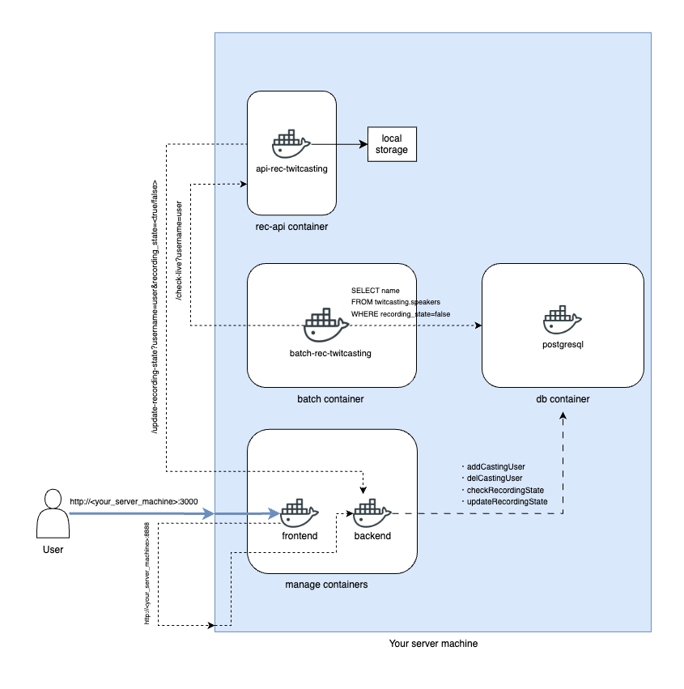

# rec-twitcasting

このアプリケーションは、twitcasting.tvで配信されているライブストリームを録画するためのものです。

[English version here](README.md)

# 重要事項

**必ず読んでください。**

## あくまで個人利用にとどめてください

当たり前ですが配信者が録画を公開しないのに**勝手に転載したりしてはいけません。**

悪用が見られた場合は**本レポジトリを非公開(private)レポジトリ**にする可能性があります。

## 自己責任でお願いします

そもそもこのアプリケーションはMITライセンスの下で開発されているため、自己責任で使ってください。
本アプリケーションの利用によって起こるいかなる問題においても、開発者は一切の責任を負わないものとします。

## issueを書く場合

バグ報告は大歓迎です！

ただし、

- 原則としてissueテンプレートを使う。
  - バグ報告(Bug report)
  - 機能追加リクエスト(Feature Request)
- リスペクトのない報告をしない。
- すでにcloseされた他のissueを含め、既知の問題か確認する。

これらは守ってください。
守られていない場合はcloseする可能性があります。

# 対応環境

- OS: Linux
- アーキテクチャ: arm64,x64

# 使用方法（クイックスタート）

Dockerをインストールしておいてください（podmanなども動作する可能性がありますが、未検証です）。
[公式インストールガイド](https://docs.docker.jp/linux/step_one.html)
[公式インストールスクリプト(英語)](https://github.com/docker/docker-install)

## 準備

環境変数で設定する項目があります。

- [APIキー](#apiキー)セクションからクライアントIDとクライアントシークレットを取得してください。それぞれ`<YOUR_TWITCASTING_CLIENT_ID>`と`<TWITCASTING_CLIENT_SECRET>`として指定する必要があります。
- このアプリケーションを実行するサーバーマシンのIPアドレスまたはドメイン名を`<YOUR_SERVER>`として指定するので確認しておいてください。
    - フロントエンド（Webサーバーアプリケーション）とバックエンド（APIサーバーアプリケーション）を同じサーバーマシンで実行する場合（オールインワン）。
    - `<BACKEND_SERVER>`は、オールインワンで動かす場合は、`<YOUR_SERVER>`に指定したパラメータが指定されます。

## 実行手順

### 1. 環境変数の設定
```shell
$ cp .env_sample .env
$ sed -i 's/__YOUR_TWITCASTING_CLIENT_ID__/<YOUR_TWITCASTING_CLIENT_ID>/g' .env
$ sed -i 's/__YOUR_TWITCASTING_CLIENT_SECRET__/<TWITCASTING_CLIENT_SECRET>/g' .env
$ sed -i 's/__YOUR_SERVER_IP_OR_FQDN__/<YOUR_SERVER>/g' .env
$ docker compose up -d
```

* Tips
アラート設定をしたい場合は、.envの、アラートしたい通知先の必要な情報を指定してください。
- 例として、LINEに通知したい場合は以下の環境変数の指定をする必要があります。
  - `LINE_CHANNEL_ACCESS_TOKEN`
  - `LINE_USER_ID`

### 2. OAuth 認証の設定

ブラウザで`https://apiv2.twitcasting.tv/oauth2/authorize?client_id=<YOUR_TWITCASTING_CLIENT_ID>&response_type=code` にアクセスしてください。

「連携アプリを許可」をすることで、 `http://<BACKEND_SERVER>:8888` にリダイレクトされ、OAuth認証が完了するはずです。

### 3. 利用開始

ブラウザで `http://<YOUR_SERVER>:3000`にアクセスしてください。

## ハンズオン


# APIキー

APIキーは[twitcasting.tv 公式ページ](https://twitcasting.tv/developerapp.php)から取得できます。

## 注意

Callback URLには、 `http://<BACKEND_SERVER>:8888/get-twitcasting-code` を指定しておいてください。

# 構成図



`k8s.drawio`は将来追加予定のKubernetesサポートの概念図です。

# ライセンス

このプロジェクトはMITライセンスの下で提供されています。

詳細は[LICENSE](LICENSE)ファイルを参照してください。
